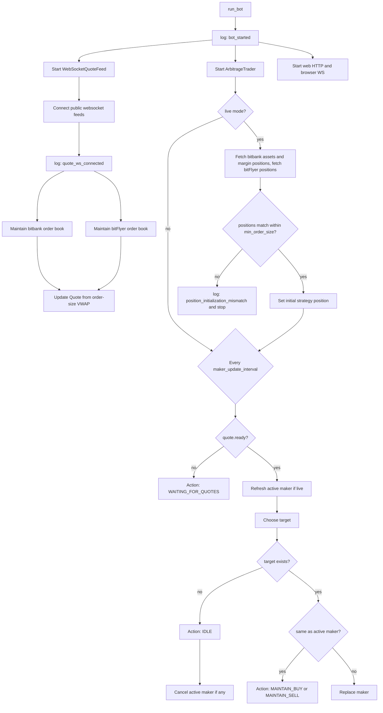
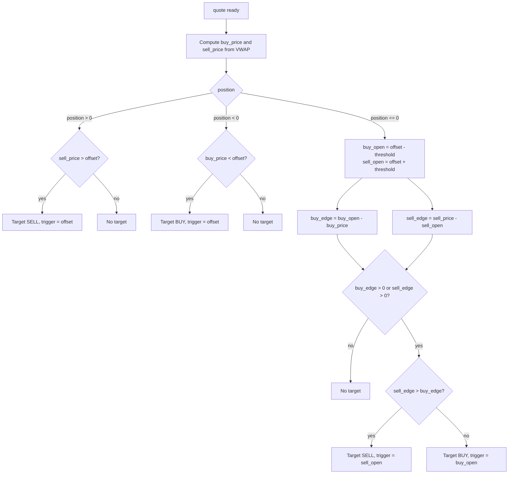
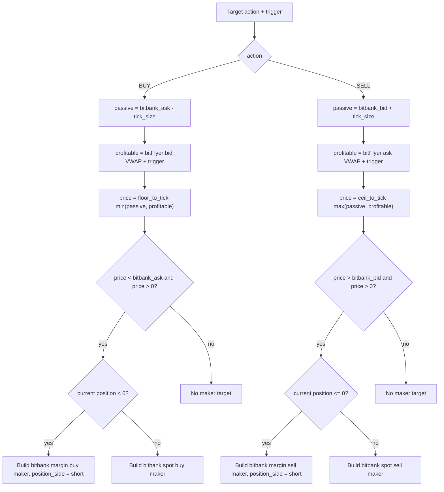
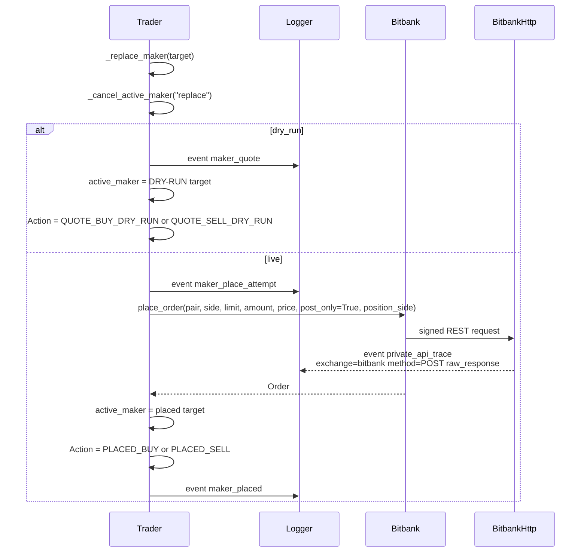
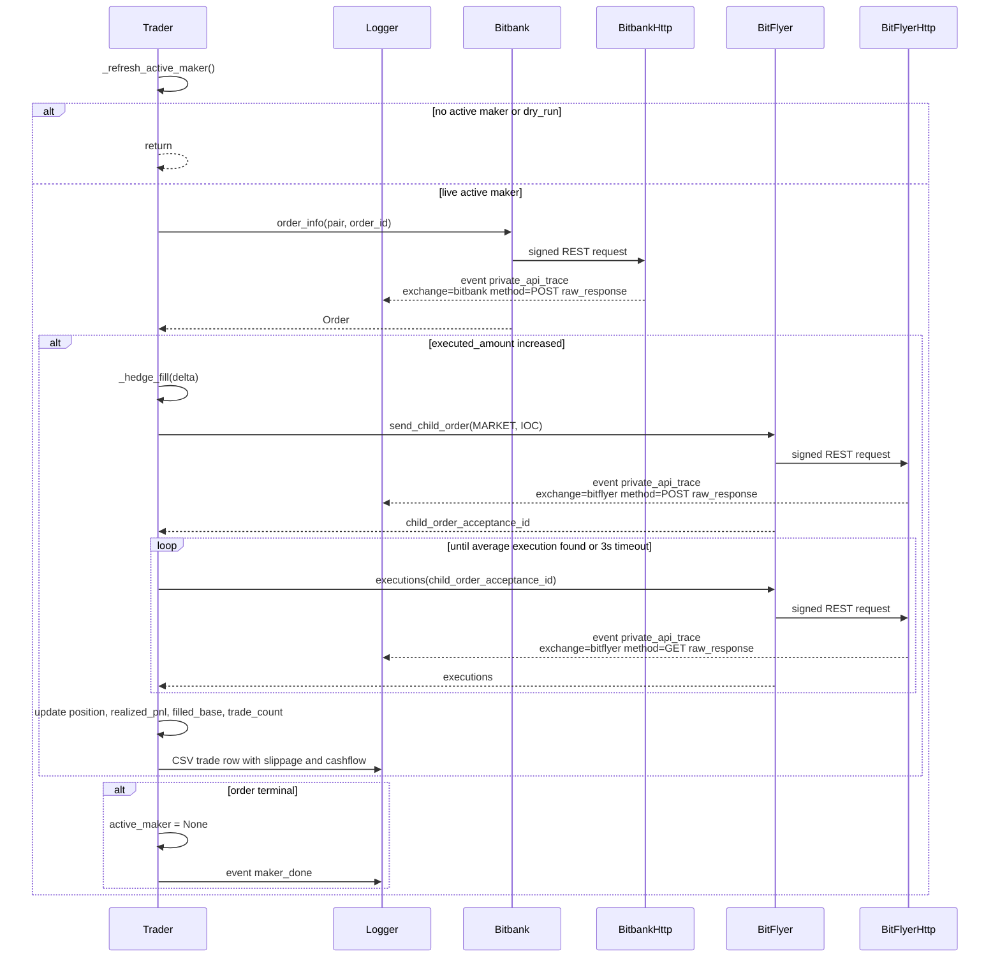
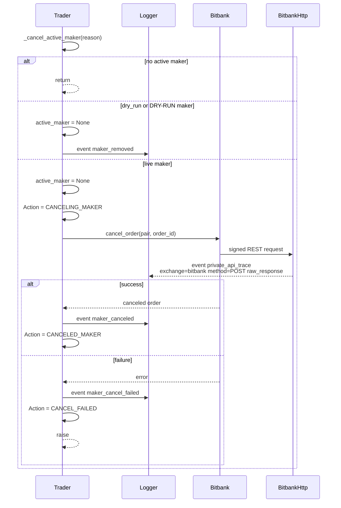
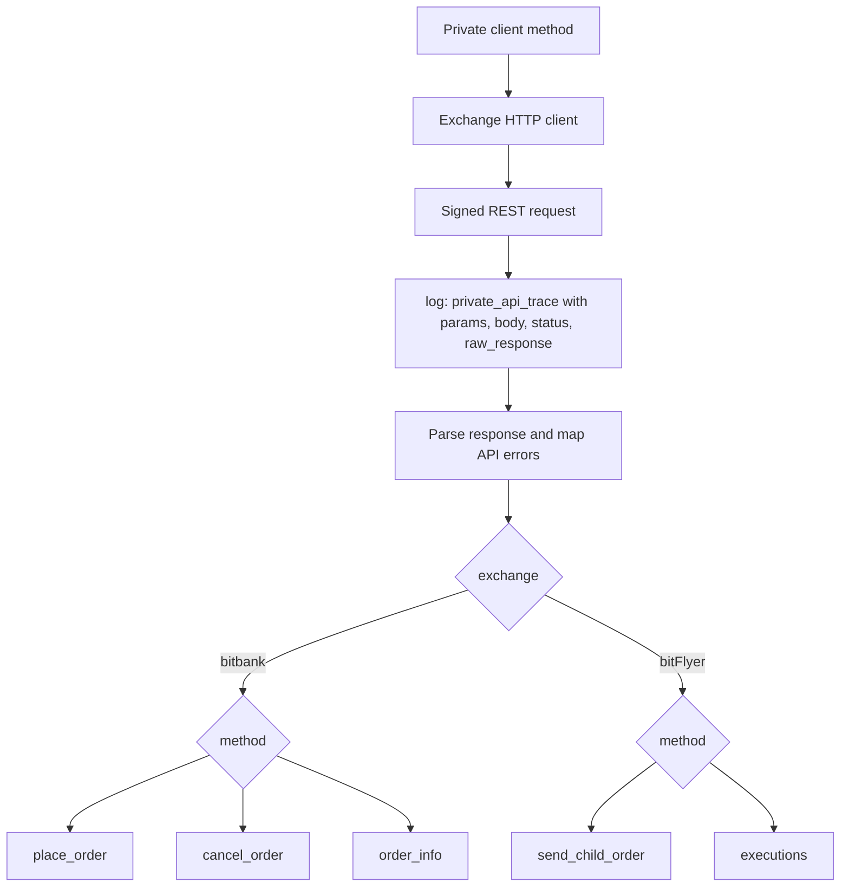

# bitbank / bitFlyer Arbitrage Flow

## Main Loop

## Target Conditions

## Maker Price Construction

## Maker Replacement, Logs, And bitbank Place Order

## Active Maker Refresh And Hedge

## Cancel Path

## Private API Trace Events

